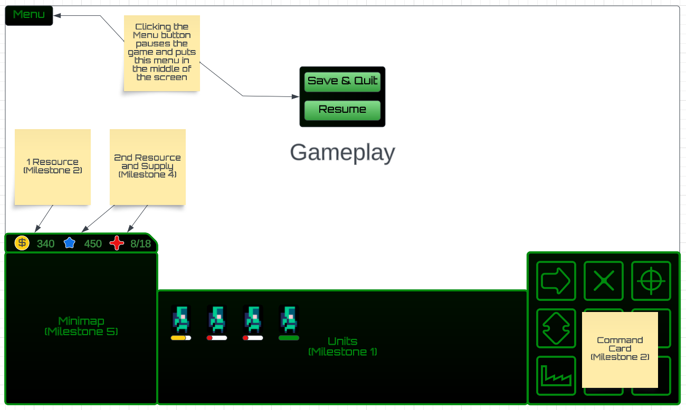

# RTS Game (working name: FarCraft) by Jordan Kovacs

## ✒️ Description
This will be a RTS game inspired by StarCraft, wherein players command an army from a top-down perspective. The goal varies by level, and may be to destroy all of your opponent's units or to survive for an amount of time.

## 🕹️ Gameplay
Gameplay depends on how many milestones are completed (see below). It consists of giving commands to units in real-time, including army units designed for combat, worker units who build and harvest (Milestone 2), and structures which produce units (Milestone 2) and research upgrades (Milestone 4). Units and structures have health and die once they run out. Units can be ordered to navigate to locations on a map and attack enemy units/structures.

## 📃 Requirements / Milestones
As this project is ambitious, the game will be developed in milestones to ensure that there is always a submittable project.

### 1 - Micro gameplay
On each level, the Player is given a starter set of units and must clear the level of enemy units. This would mimic the design of StarCraft's "installation" missions (see: [The Jacobs Installation](https://strategywiki.org/wiki/StarCraft/Terran_mission_4:_The_Jacobs_Installation)). This would be submittable if I run out of time but is less than I want this project to be.
- The level consists of a tilemap grid, however units themselves are not bound to the grid and can be positioned between tiles.
- There are premade levels (created in [Tiled](https://www.mapeditor.org)) which will be played through sequentially.
- Player can scroll their view of the map with the arrow keys.
- Player can select units, either individually by clicking them or as a group by dragging a box around them with their cursor. The UI will show which units are selected and how much health they have.
- Player can command units to move and attack.
- Units die when they run out of health.
- There is a basic set of units, likely a ranged unit akin to the Marine, a melee unit akin to the Zealot, and a crowd-control unit like the Firebat.
- The enemy will consist of preplaced units. They will remain idle until aggrevated, at which point they will begin to attack the player's units.
- If the game is submitted at this stage:
	- The player will be able to rescue other units scattered throughout the levels and add them to their army.
	- The player loses when they lose all of their units.
- Technical requirements:
	- Pathfinding (using A*) and collision (likely using a grid to split the world into smaller chunks)
		- Problem: Multiple units moving along the same path are likely to clump up and conflict with each other. This led to infamously poor pathfinding in StarCraft. The solution will likely include treating units as "soft bodies" as StarCraft 2 seems to do.
	- Basic UI showing unit health and control group information
	- Basic title screen
	- Win/loss screen showing basic stats (enemies killed, units lost, time taken, points, etc)
	- Serialization: The game can be saved. Ideally this would include saving an ongoing game (complicated serialization), though simply saving the current level's number would also work.

### 2 - Macro gameplay
The player now controls worker units and buildings in addition to army units.
- Workers can build structures; the player selects a worker unit, selects the Build option from a "command card" UI, selects the building they wish to construct, and selects a location where the building should be placed (a "wireframe" of the building will be displayed to show the player where the building will be placed).
- At minimum, structures will include:
	- A "town hall" structure which produces worker units and where worker units can deposit harvested resources.
	- A factory structure from which army units can be produced.
- Buildings and units cost resources and take time to build/train; For this milestone, there will only be one resource (like "money" or something).
- Workers can harvest resources from caches and will return them to the nearest town hall.
- Player loses if all of their structures are destroyed (they can have remaining units and still lose).
- If the game is submitted at this stage:
	- In addition to levels with pre-placed idle units, there will be "survival" levels in which the player must survive enemy waves for a given amount of time (see [StarCraft Terran Mission 3: Desperate Alliance](https://strategywiki.org/wiki/StarCraft/Terran_mission_3:_Desperate_Alliance)).
- Technical requirements:
	- UI to handle making buildings and creating units (command card)

### 3 - Enemy AI
A rudementary AI will manage bases and create units just like the player does.
- Enemy AI will be extremely rudementary. It will involve:
	- Building town-hall structures in appropriate locations.
	- Building other structures in reasonable locations.
	- Producing worker units and commanding them to harvest resources.
	- Producing army units and sending them to the player's base in waves.
	- Macro logic which determines when the AI should expand to a new base.

### 4 - Variety
Gameplay is expanded upon to add depth.
- A second resource
- A supply system (units contribute to supply usage, the amount of supply available can only be increased by building certain structures) 
- A tech tree (certain buildings can only be built if other specific buildings currently exist)
- Research (certain buildings research upgrades or unlock abilities)
- Casting (certain units can use special abilities)
- More AI macro logic to make it progress along the tech tree.
- More AI micro logic to let it use specialty/caster units.

### 5  - Polish
- Add main-menu UI allowing the user to start a game with customized settings
- Add minimap
- Add standard RTS controls for selecting units
	- Control groups
	- Select by unit type with Ctrl-Click
	- Add/Remove units with Shift-Click
- Full-screen
- Dragging the map around with middle click
- Ordering units to stop
- Hotkeys
- Options menu (ex. for audio settings)
- General polish

### 6 - Multiplayer
Players can host sessions and connect to another player's session to fight in 1v1 matches.
- Peer-to-peer connection will be done through WebRTC, using Firebase to handle [ICE](https://developer.mozilla.org/en-US/docs/Web/API/WebRTC_API/Protocols).
- Connection will only be possible through IP addresses. One player opens a game lobby, and the other player needs to join the lobby by entering the player's IP.

### 🤖 State Diagram

### 🗺️ Class Diagram
> [!NOTE]
> I am considering using the Visitor pattern for my entities. This pattern uses composition rather than inheritance. It is similar to the component-based design encouraged by engines like Godot, and works vaguely like a state machine. It also justifies the use of the factory pattern.
> If I go with this pattern, Entities will likely stop using inheritance.

### 🧵 Wireframes

#### Main Menu

- *Continue* will load the player's most recent game, if there is one.
- *New Game* will start the player in the first level.

#### In-game HUD

- The display in the bottom middle shows the currently selected units and their health.
- The command map shows the possible actions for the selected units (Milestone 3).
- The minimap shows dots for any units/structures within the map (Milestone 5).
- The resource display above the minimap shows the player's current resources (Milestones 3 & 4).
- The menu button pauses the game and opens a menu which allows the player to, at the least, save and quit.

## 🎨 Assets

### 🖼️ Sprites and Images
- Unit and terrain sprites will likely come from Trevor Pupkin's [Outer Buddies](https://trevor-pupkin.itch.io/outer-buddies) and [Tech Dungeon: Roguelite](https://trevor-pupkin.itch.io/tech-dungeon-roguelite) sets.
- If needed, further sprites for effects may be taken from BDragon1727's [Free Effect Bullet Impact Explosion 32x32](https://bdragon1727.itch.io/free-effect-bullet-impact-explosion-32x32) and [Fire Pixel Bullet 16x16](https://bdragon1727.itch.io/fire-pixel-bullet-16x16) sets.
- UI sprites will likely come from BDragon1727's [Basic Pixel Health bar and Scroll bar](https://bdragon1727.itch.io/basic-pixel-health-bar-and-scroll-bar) set.
- Structure sprites will likely be made by myself matching Trevor Pupkin's style. These will probably look ugly/plain. No time, don't care.
- Main menu background image will be ["Merging Star Clusters in 30 Doradus" by Nasa](https://science.nasa.gov/image-detail/41156165560-4438592e93-o/) ([no copyright](https://www.nasa.gov/nasa-brand-center/images-and-media/))

### 🎵 Music
More songs may be added a development goes on (ex. if a new race is added).
- [Spritz-Therapy by Koi-discovery](https://freemusicarchive.org/music/koi-discovery/single/spritz-therapy/)
- Any number of songs by [Darkfluxx](https://freemusicarchive.org/music/darkfluxx/)
	- [DARKFLUXX_Theme.mp3 by Darkfluxx](https://freemusicarchive.org/music/darkfluxx/single/darkfluxx-thememp3/)
	- [A Step Closer by Darkfluxx](https://freemusicarchive.org/music/darkfluxx/single/a-step-closermp3/)
- Any number of songs by [bent wyre](https://freemusicarchive.org/music/bent-wyre/)

### ✏️ Fonts
As I'm going for a sci-fi feel, fonts will likely include:
- [Share Tech](https://fonts.google.com/specimen/Share+Tech)
- [Orbitron](https://fonts.google.com/specimen/Orbitron)
- May also include fonts from the public domain [Not Jam Font Pack](https://not-jam.itch.io/not-jam-font-pack)

### 🔊 Sounds
#### Gun shots:
- [M41A Pulse rifle by Balcoran](https://freesound.org/people/Balcoran/sounds/478185/)
- Sound effects from [ZapSplat](https://www.zapsplat.com/sound-effect-category/lasers-and-weapons/):
	- [Flamethrower sound effects](https://www.zapsplat.com/sound-effect-category/flame-thrower/)
	- [Lazer weapon sound effects](https://www.zapsplat.com/sound-effect-category/lasers-and-weapons/)

#### Deaths:
- [Male Scream in Fear by UNIVERSFIELD](https://pixabay.com/sound-effects/male-scream-in-fear-123079/)

## Criteria Summary
Ways in which every criteria is met:
- 🤖 State Machines: There is a global game state. Entities will have their own states.
- 🧱 Inheritance & Polymorphism: Factories use inheritance. Entities may use inheritance unless composition is used instead.
- 🏭 Factory Design Pattern: Factories are used to create units / structures.
- 🔢 Enums: Enum is used to (de)serialize the game state. Will likely find other use cases as development continues.
- ⭐ Game Entities & Game Objects: All units/structures are considered an Entity. "Game Objects" are a weird distinction and will not be used (criteria states they are optional).
- 🎯 Collision Detection & Hitboxes: World is collidable. Entities have hitboxes (circles for Units, grids for Structures).
- 💾 Persistance: At least current level's number can be saved. Ideally save entire game state.
- 🎉 Win & Loss Conditions: Player wins if they kill all enemy units (Milestone 1 only), survive a given amount of time (Milestone 2 only), or destroy all enemy structures (Milestone 3+). Player loses if they lose all units (Milestone 1 only) or structures (Milstone 2+).
- 🏆 Score/Points/Prizes: Player is shown a stats screen at the end of every level (win or lose) which includes scores.
- 👾 Sprites: Everything is a sprite.
- 🏃🏾‍♂️ Animations: Units have animations.
- ➡️ Tweens: Menus will tween. Factory structures will also tween when producing units. Worker units will likely also tween while harvesting resources. Tweens will not be used for any other game logic because using tweens outside of visuals is extremely error prone.
- 🎵 Sounds & Music: See 🎨 Assets. Units/Structures will play sounds when they attack/spawn/die.
- 🖋️ Fonts: See 🎨 Assets.
